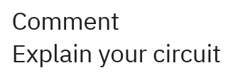
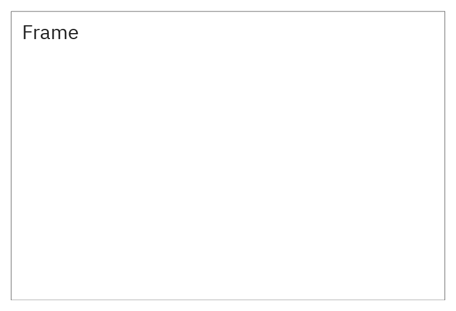

# Comments and frames

[Component index](README.md) · [Interface](../guides/interface.md)

Use comments and frames to explain and organize your circuit.

## Comment



Place Comment from Components or press T. Properties has **Text**; the current
single-line field represents newlines as `\n`.

Text supports headings, emphasis, colors, code, and links:

```html
<h2>Datapath</h2>
<b>Accumulator</b><br />
<font color="red" size="4">Watch this bus</font>
<code>R0</code>
<a href="https://example.com">Documentation</a>
<a href="module:RegisterFile">Open register file</a>

```

Supported display runs include headings, bold/strong, italic/emphasis, code/pre,
font color/size, line breaks, paragraphs, lists, simple table-cell spacing,
links, and image alt-text placeholders. Common named colors and hex colors work.
Save the document to keep the annotation’s text and formatting.

**Cmd/Ctrl-click or double-click** a link:

- HTTP(S) opens the URL through the platform.
- `module:Name` navigates to a module definition (or a uniquely resolvable live
  instance).
- A `.v`/`.rgate` relative link resolves beside a desktop-opened document. Save
  current edits first; unsaved changes block file-link replacement.
- In the browser, use File → Open to select a circuit from your device.

Image tags display their alt text as a placeholder. Use headings, colors, and
links to make the annotation easy to follow.

## Frame



Place Frame to draw a background rectangle behind circuit content. Set title in
Properties, or leave the text empty to display its instance name. Set frame
width/height, or drag its **bottom-right corner** in Select mode. Dimensions are
constrained to 20–10000 world-coordinate units.

Select and move a frame by its border; click inside it to work on the enclosed
gates. Drag its bottom-right corner to resize. Use a gate/wire selection to move
a group together. Save the document to keep frame placement and titles.
