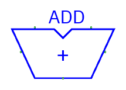
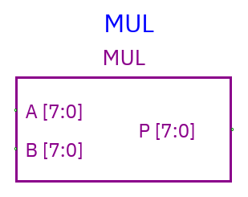
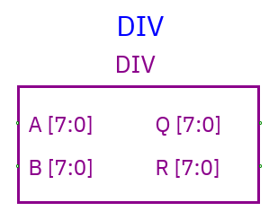
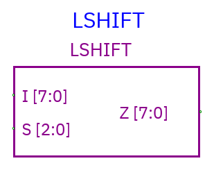
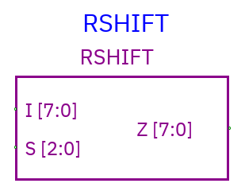
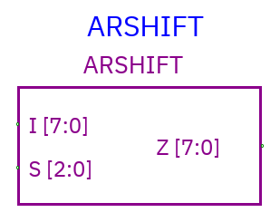
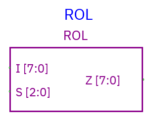
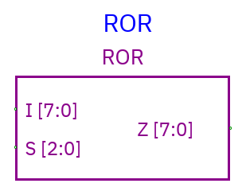

# Arithmetic, shifts, and rotates

[Component index](README.md)

## Adder

**Inputs:** `A`, `B` data buses and scalar `CI` carry-in. **Outputs:** `S` sum
and scalar `CO` carry-out. Data widths match the configured width (default 8).

S is the low-width sum; CO is the overflow carry. Connect CI to Ground for a
zero carry-in. For eight bits, A=255, B=2, CI=1 → S=2, CO=1. Four-state carry
logic propagates controlling/unknown bits rather than converting the whole sum
into a machine integer.

The output is a bit vector; whether it represents signed or unsigned data
depends on your interpretation. CO reports the carry out.

## Multiplier

**Inputs:** A and B; **output:** P. Overall **Bit width** controls P. **Operand
A width** and **Operand B width** can be configured separately; defaults match
P. All are 1–4096 bits.

Operands are interpreted **unsigned**. Product is truncated to P's width. A=20,
B=20, output width=8 → P=144 because 400 modulo 256 is 144. Unknown/floating
operands produce unknown output.

## Divider

**Inputs:** A dividend, B divisor. **Outputs:** Q quotient and R remainder. A/B
widths can be configured independently; Q/R use the overall width.

Unsigned integer division: A=23, B=5 → Q=4, R=3. Narrow outputs truncate.
**Division by zero yields X**. Unknown/floating operands also yield X.

## Shared shift/rotate interface

| Component              | Symbol                                                                                          |
| ---------------------- | ----------------------------------------------------------------------------------------------- |
| Shift left             |                          |
| Shift right            |                        |
| Arithmetic shift right |  |
| Rotate left            |                        |
| Rotate right           |                      |

**Inputs:** I data and S amount; **output:** Z data. I/Z have matching widths.
Newly created S pins use ceiling(log2(data width)), with at least one bit.
Eight-bit data therefore has a **3-bit selector**, representing 0–7. Existing
documents retain their saved pin layouts, which may use a wider selector.

Use a three-bit source for an eight-bit shift amount, with values from 0 to 7.
Unknown S produces X. Data X/Z bits are preserved when moved; inserted zero bits
are known zeros.

| Component                          | Operation                                               |
| ---------------------------------- | ------------------------------------------------------- |
| Shift left (`LSHIFT`)              | Move toward higher bit indexes; insert zeros at low end |
| Shift right (`RSHIFT`)             | Move toward lower bit indexes; insert zeros at high end |
| Arithmetic shift right (`ARSHIFT`) | Right shift; fill high bits with original sign bit      |
| Rotate left (`ROL`)                | Shift left with high bits wrapping into low end         |
| Rotate right (`ROR`)               | Shift right with low bits wrapping into high end        |

On eight-bit I=0x81 and S=1: left shift=0x02; logical right=0x40; arithmetic
right=0xC0; rotate left=0x03; rotate right=0xC0.

Rotate amount wraps modulo data width. A logical shift at or beyond width, if a
saved select pin allows it, yields zero; arithmetic right repeats the sign bit.
Arithmetic shift takes its sign from the top bit.

## Wide values

Arithmetic supports buses from 1 to 4096 bits. Enter wide values in hexadecimal
or decimal, and choose operand/output widths to retain the bits you need.
