# Inputs and displays

[Component index](README.md) · [Simulation](../guides/simulation.md)

## Switch

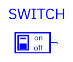

**Pin:** `Z` output, normally one bit. Initial value comes from Properties.
During simulation click the switch to toggle 0/1. Runtime toggles do not rewrite
the initial property and reset on a fresh simulation.

Use for reset, enable, mode, and other manual controls. On active-low inputs a
switch at zero **asserts** the control; the LC-3's RESET_N is an example.

## DIP switch

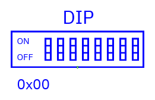

**Pin:** `Z` output, configurable bus width; default eight bits. Set a decimal
or `0x` initial value before simulation.

During simulation click the DIP to open a **hex value** dialog. Enter digits
such as `AB` or `0xAB`, then Apply. The value must fit the bus, including widths
above 64 bits. The simulator pauses for input entry; resume when ready. This is
not the same as changing saved initial contents.

## Ground and Vdd

| Component | Symbol                                                          |
| --------- | --------------------------------------------------------------- |
| Ground    | 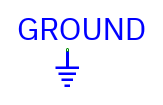 |
| Vdd       | 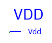       |

**Pin:** `Z` output. Ground supplies all-zero bits; Vdd supplies all-one bits at
the selected width. They need no data inputs. They are digital constants, not
analog voltage sources.

## Clock

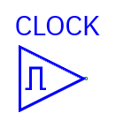

**Pin:** `Z` one-bit output. Set period, phase delay, and high-duty percentage
(1–99) in Properties. Period must be at least 2 ns.

The clock starts low. Its first rising edge occurs after **phase + low
interval**. High time is period×duty/100 rounded down and clamped to at least 1
ns and at most period−1; low time is the remainder.

Example: period=100 ns, phase=10 ns, duty=25% → rising at 85 ns, falling at 110
ns, rising at 185 ns. Default duty is 50%.

Press Tab to advance one period of the fastest clock in the running hierarchy.
Play advances simulated time, not physical time. See
[simulation](../guides/simulation.md).

## LED

| Component            | Symbol                                                                                   |
| -------------------- | ---------------------------------------------------------------------------------------- |
| Bit LED              | 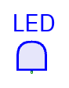                            |
| Bar graph            | 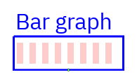                      |
| Direct seven-segment | 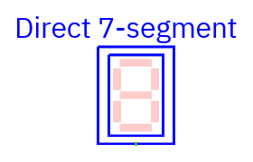 |
| Hexadecimal digits   | 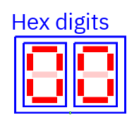             |
| Decimal digits       | 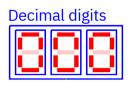             |

**Pin:** `I` input. LEDs are observers; they do not drive their net.
Double-click in Edit or select/Enter to choose **Display type**.


| Mode             | Meaning                                                                  | Recommended width |
| ---------------- | ------------------------------------------------------------------------ | ----------------- |
| Bit LED          | On/off indicator; first bit drives the lamp                              | 1                 |
| Bar graph        | One light per bit; most-significant on left                              | 8                 |
| Hex digits       | One seven-segment digit for each four bits                               | 8 (two digits)    |
| Decimal digits   | Unsigned value, enough digits for the full width; leading zeros retained | 8 (three digits)  |
| Direct 7-segment | Seven input bits independently drive each digit's segments               | 7 (one digit)     |

Selecting a mode on an **unwired** LED applies the recommended width. Properties
shows the resulting lights/digits. You can override width before wiring.
Selecting a mode on a **wired** LED preserves bus width.

Direct segment map for each seven-bit group:

```text
          bit 0
       ┌────────┐
 bit 1 │        │ bit 2
       ├────────┤  ← bit 3
 bit 4 │        │ bit 5
       └────────┘
          bit 6
```

The low seven bits drive the rightmost digit; additional groups appear to its
left. Hex groups also start with the low nibble on the right. For an incomplete
high digit, bits outside the bus are zero.

Classic on/off segments are red/pale red; X is gray and Z amber. Other themes
use their palette. A floating bus is not a valid number; a hex digit with
unknown bits is marked unknown rather than inventing a value. LEDs rotate with
the component. Old documents without a mode default to Bit; TkGate `/type:` is
imported.

## GPIO peripheral

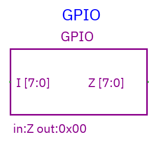

**Pins:** `I` input and `Z` output, both at configured width (default eight). Z
starts at the initial value. Click during simulation to increment it modulo its
width. The component shows incoming I and outgoing Z values.

This is a simple built-in interactive peripheral. It is not a physical GPIO
device, Tcl plugin, or external hardware connection. The output can drive a
circuit while I watches another signal; they need not be connected.

For a text terminal, use [TTY](tty.md).
