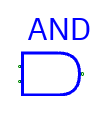
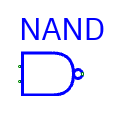
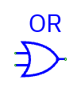
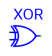
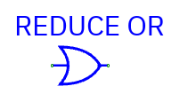
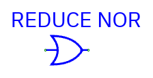
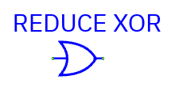
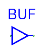
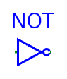
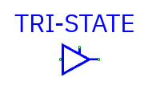

# Logic gates

[Component index](README.md) · [Routing](routing.md)

## AND, NAND, OR, NOR, XOR, XNOR

| Component | Symbol                                                      |
| --------- | ----------------------------------------------------------- |
| AND       |    |
| NAND      |  |
| OR        |      |
| NOR       |    |
| XOR       |    |
| XNOR      |  |

**Pins:** `I0 … I<n−1>` inputs, `Z` output. Configure input count (1–64) and
output/data width in Properties.

| Component | Operation on each bit   | Scalar example |
| --------- | ----------------------- | -------------- |
| AND       | All inputs must be 1    | `1 AND 0 = 0`  |
| NAND      | Inverted AND            | `1 NAND 1 = 0` |
| OR        | At least one input is 1 | `1 OR 0 = 1`   |
| NOR       | Inverted OR             | `0 NOR 0 = 1`  |
| XOR       | Odd parity of inputs    | `1 XOR 1 = 0`  |
| XNOR      | Inverted XOR            | `1 XNOR 1 = 1` |

Buses are processed **bit by bit**, not reduced to a scalar. A single-bit
logical input broadcasts across every bit of a wider gate: an AND gate with an
8-bit data input and a scalar enable of 1 passes the data; enable 0 produces
zero.

A controlling input may determine the result even with unknowns: `0 AND X = 0`,
`1 OR X = 1`. XOR with X/Z becomes X. Inverted variants invert the result, with
unknown remaining unknown.

## Six reduction gates

| Component      | Symbol                                                                       |
| -------------- | ---------------------------------------------------------------------------- |
| Reduction AND  |    |
| Reduction NAND |  |
| Reduction OR   |      |
| Reduction NOR  |    |
| Reduction XOR  |    |
| Reduction XNOR |  |

**Entries:** Reduction AND, Reduction NAND, Reduction OR, Reduction NOR,
Reduction XOR, Reduction XNOR.

**Pins:** `I0` is a bus input; `Z` is **one bit**, regardless of input width.
The width property is the input bus width. Default: eight input bits.

They apply their operation across all bits of that one bus:

- Reduction AND is 1 only if every bit is 1; NAND inverts it.
- Reduction OR is 1 if any bit is 1; NOR inverts it.
- Reduction XOR is 1 for odd population count; XNOR inverts it.

Example for `I0 = 0x03` on eight bits: AND=0, NAND=1, OR=1, NOR=0, XOR=0,
XNOR=1.

Ordinary logic-gate Properties also has **Reduce input bus to one bit**.
Disconnect before changing the reduction option because the pin width/layout
changes. A dedicated reduction entry always remains a reduction gate.

## Buffer and NOT

| Component | Symbol                                                          |
| --------- | --------------------------------------------------------------- |
| Buffer    |  |
| NOT       |        |

**Pins:** `I` input and `Z` output, matching data widths.

- **Buffer** produces the same known `0/1` input. Floating `Z` or unknown `X`
  input becomes **X**; a buffer is not merely a wire.
- **NOT** inverts each known bit; X/Z becomes X.

Buffers preserve gate delay and isolate logic stages. Use Vdd/Ground or actual
drivers rather than assuming an unconnected buffer input is zero.

## Tri-state buffer

**Pins:** `I` data input, `E` one-bit enable, `Z` data output. Data width is
shared by I/Z. Properties contains **Active-low enable** and **Invert enabled
output**.

| Active-low | Invert | Verilog equivalent | Enabled at |
| ---------- | ------ | ------------------ | ---------- |
| Off        | Off    | `bufif1`           | E=1        |
| On         | Off    | `bufif0`           | E=0        |
| Off        | On     | `notif1`           | E=1        |
| On         | On     | `notif0`           | E=0        |

When disabled, Z is **high impedance**, not zero. Enabled inputs are
buffered/inverted; enabled X/Z data becomes unknown. An unknown enable generally
produces unknown output.

Several tri-state drivers can share a bus when only one drives it at once.
Conflicting active drivers produce X. An inverted tri-state gate is **not**
equivalent to an ordinary inverter after a tri-state gate: the separate inverter
turns a floating input into X, whereas a disabled `notif` output stays Z.

Typical use: register data → I, arbitration control → E, shared bus ← Z. Probe
the bus to detect conflicts.
