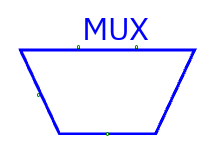
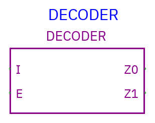
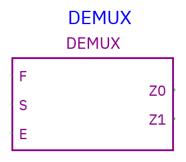
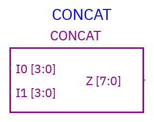
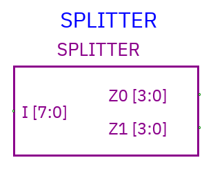
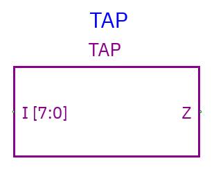

# Routing and bus components

[Component index](README.md) ·
[Editing wires](../guides/interface.md#wiring-and-buses)

## Multiplexer



**Pins:** `I0 … I<n−1>` data inputs, `S` select input, `Z` data output. Data
inputs/output share the configured width. Configure input count (2 or more)
before wiring. Select width is the binary width required for the count, at least
one bit: two inputs → 1 select bit; eight → 3 bits.

S=0 selects I0, S=1 selects I1, etc. Unknown/out-of-range select yields X. A mux
chooses a whole data bus; it doesn't independently choose each bit. Default is
two one-bit inputs.

Example: I0=0x12, I1=0x34, S=1, width=8 → Z=0x34.

## Decoder



**Pins:** `I` binary index input, `E` scalar enable input, `Z0 … Z<n−1>`
**scalar** outputs. Configure 2–64 output count. I width is
ceiling(log2(count)).

E is **active-high** and unconnected E defaults enabled. When enabled, exactly
the output indexed by I is 1; others are 0. E=0 makes all outputs 0. Unknown
index/enable yields unknown outputs; a known out-of-range index selects none.

This is a binary-to-one-hot decoder, not a CPU instruction interpreter. Build
instruction decoding from taps, decoders, and gates or a ROM.

## Demultiplexer



**Pins:** `F` data bus, `S` binary select, `E` scalar enable, `Z0 … Z<n−1>`
output buses. Configure output count 2–64 and data width.

With E=1, selected Z receives F; all other Z outputs are zero. E=0 makes all
outputs zero. Unknown select/control yields unknowns. Default unconnected E is
enabled. Unlike a mux, it sends **one input to one of many outputs**.

## Concatenation (Concat)



**Pins:** partition inputs `I0 …`, full bus output `Z`. Set **Partitions (LSB
first)** to comma-separated widths. Each width is positive; the sum must equal
the overall bus width. Up to 64 partitions are supported.

```text
Overall width: 8
Partitions:    4,4
I0 = 0xB (low nibble)
I1 = 0xA (high nibble)
Z  = 0xAB
```

**I0 is the least-significant partition**, the reverse of left-to-right Verilog
concatenation notation. The equivalent Verilog expression is `{I1, I0}`. X/Z
bits are preserved; concatenation isn't arithmetic addition.

TkGate's supported annotated `assign out = {a,b,...}; //: CONCAT ...` imports as
a joiner with original endpoint coordinates. Imported compact joiners draw a
narrow connector rather than a large generic block.

## Bus splitter



**Pins:** full bus `I`, partitions `Z0 …`. The same partition rules apply. Z0
extracts the low partition, then Z1 the next group of bits.

I=0xAB on eight bits, partitions 4,4 → Z0=0xB, Z1=0xA. Change partitions before
wiring; existing net widths won't automatically resize.

## Bus tap



**Pins:** full bus input `I`, slice output `Z`. Configure input width, **Tap bit
offset** (zero-based LSB index), and **Tap output width**. Offset+output width
must not exceed input width.

Example: eight-bit I=0xAB, offset=4, output width=4 → Z=0xA. X/Z bits are copied
as-is. Tap is **read-only**: output drivers cannot write selected bits back into
I.

You can place Tap explicitly or create one by starting a narrower wire and
dropping it onto an existing wider bus. The automatic tap begins at offset 0;
use Properties to choose the desired slice. Undo removes the whole automatic-tap
edit.

## Avoid common width mistakes

Set the source and destination widths before connecting. Binary select width is
not data width. A 16-bit mux may have a 1-bit selector; a splitter's 4-bit
outputs cannot directly drive an 8-bit LED. Use Concat/Tap or deliberately
matching component widths.

Wire crossings do not merge nets. A shared bus must have proper arbitration
(often tri-state drivers); Concat/Splitter only transform bit layouts, not
drive-enable behavior.
