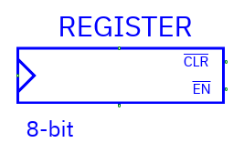
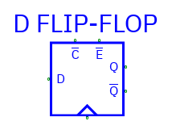
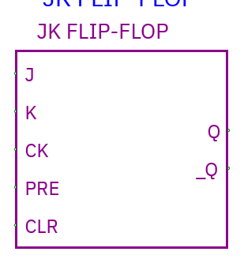
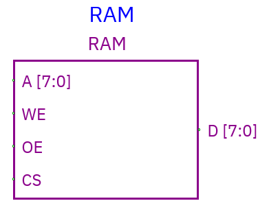
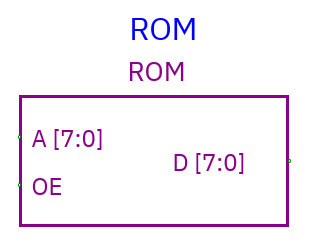

# Sequential components and memory

[Component index](README.md) · [Simulation](../guides/simulation.md)

## Register



| Pin | Direction          | Meaning                            |
| --- | ------------------ | ---------------------------------- |
| D   | Input, data width  | Value to store                     |
| Q   | Output, data width | Stored value                       |
| CK  | Input, one bit     | Rising-edge clock                  |
| EN  | Input, one bit     | **Active-low** load enable         |
| CLR | Input, one bit     | **Active-low**, asynchronous clear |

CLR=0 clears the stored value to zero without waiting for a clock. With CLR=1, a
CK rising edge samples D only when EN=0. EN=1 holds the value. Unconnected CLR
defaults to 1, EN to 0, and CK to 0. Connected unknown controls can make the
result unknown.

A fresh register starts X unless cleared. Its generic Initial value property is
not a stored-state initializer. Q changes after its output delay. Ensure D and
controls settle before a rising edge; the simulator does not report setup/hold
violations.

## D flip-flop



**Pins:** `D`, `CK`, `EN`, `CLR` as above; outputs `Q` and `_Q`. `_Q` is the
bitwise complement of stored Q. Behavior, active-low control polarity, and
unconnected defaults match Register. Data may be multi-bit even though the
familiar symbol represents a flip-flop.

Use Register when one output bus is enough; D flip-flop supplies both
polarities.

## JK flip-flop



**Inputs:** `J`, `K` data-width buses; `CK`, `PRE`, `CLR` scalar controls.
**Outputs:** `Q`, `_Q`.

With PRE=CLR=1, each bit behaves on CK rising edge as:

| J   | K   | Q next     |
| --- | --- | ---------- |
| 0   | 0   | Hold       |
| 0   | 1   | Reset to 0 |
| 1   | 0   | Set to 1   |
| 1   | 1   | Toggle     |

PRE and CLR are **active-low asynchronous** controls. CLR=0 resets; PRE=0 sets.
Both low yields X. Unconnected PRE/CLR default high; unconnected clock low. This
is conventional JK behavior rather than copying TkGate's apparent PRE/CLR
reversal in one upstream model.

## RAM



| Pin | Direction              | Meaning                         |
| --- | ---------------------- | ------------------------------- |
| A   | Input, 1–32 bits       | Word address                    |
| D   | **InOut**, 1–4096 bits | Write data and driven read data |
| CS  | Input, one bit         | **Active-low** chip select      |
| WE  | Input, one bit         | **Active-low** write enable     |
| OE  | Input, one bit         | **Active-low** output enable    |

- CS=0 and WE=0 writes external data present on D at A. Writes are asynchronous
  and level-sensitive, not clocked.
- CS=0 and OE=0 drives the stored word onto D after output delay.
- CS=1 or OE=1 makes the RAM's D driver Z. That does not force the shared bus to
  Z if another device drives it.
- Unconnected controls default inactive/high. Unknown address/control is not a
  valid access. An active write to unknown address invalidates retained contents
  conservatively.

**Safe write/read sequence:** disable RAM output (OE=1), drive A/D externally,
select/write (CS=0, WE=0); end writing (WE=1), release the external D driver,
then read (OE=0). If an external driver and RAM drive incompatible data, the bus
resolves to X. Sparse storage supports addresses through xFFFFFFFF without
allocating the entire address space.

## ROM



**Pins:** A address input, D data output, OE active-low scalar input. OE=0
reads; OE=1 releases D to Z. No CS or WE, and no circuit write operation.
Runtime inspector edits are a debugging convenience, not a ROM write pin.

## Initial images

RAM/ROM Properties contains **Address bits**, **Initial hex words**, and **Load
hex file…**. Each word must fit the data width. Unspecified words start **X**,
not zero.

```text
41 42 FF        // addresses 0, 1, 2
@0010 AB CD     // addresses hex 10, 11
@FFFFFFFF 12   // valid only with 32 address bits
x z             # whole-word unknown/floating values
```

Words are hexadecimal, separated by whitespace or commas. `@` selects a
hexadecimal word address; comments use `//` or `#`. Hex digits are accepted for
widths beyond 64 bits. The sparse parser caps initialized words at one million;
setting a high address doesn't allocate intervening words.

Desktop loads a text file; web uploads it. Apply stores initial contents in the
document. Changing data/address widths requires disconnection and an image
matching the new dimensions.

## Runtime inspection

Double-click RAM/ROM in **Simulate** to inspect initialized/current words. Enter
a **decimal address** and **hex value** to edit one runtime word. Current
listing is limited to the first 512 stored entries. Edits are volatile: a
Stop/new simulation reloads the initial image. To keep contents, update initial
Properties and save the circuit.

Runtime memory and sequential state are **not restored by workspace recovery**.
No memory access-time/setup/hold checking or analog drive strengths are modeled.
Large memories are sparse logical devices, not a physical-chip timing model.
