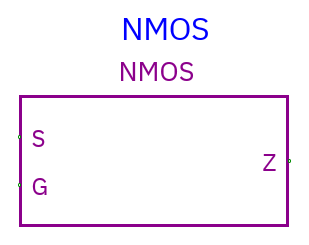
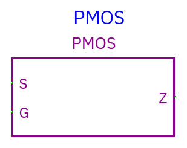

# NMOS and PMOS

[Component index](README.md) · [Logic gates](logic.md)

| Component | Symbol                                                      |
| --------- | ----------------------------------------------------------- |
| NMOS      |  |
| PMOS      |  |

Both are **unidirectional digital pass-device models**, not analog transistor
simulation.

**Pins:** S source-data input, G control-data input, Z output. All pins have the
configured width; multi-bit devices behave as parallel transistors. G is not
necessarily a scalar enable bus.

| Component | Conducts when each G bit is | Disabled Z bit |
| --------- | --------------------------- | -------------- |
| NMOS      | 1                           | Z              |
| PMOS      | 0                           | Z              |

When conducting, each Z bit receives the corresponding S bit. Unknown G
generally produces X, except a floating S remains Z. When disabled, the device
releases the output; other drivers can still determine its shared net value.

Example NMOS: S=1, G=1 → Z=1; S=1, G=0 → Z=Z. PMOS has the opposite known
control polarity.

These follow the direction of TkGate's Verilog-style primitive wrappers. They
**do not** solve voltages/currents, model thresholds/resistance/capacitance or
drive strength, or automatically conduct bidirectionally. Use a real
analog/switch-level simulator when those properties matter. Net driver conflicts
remain four-state digital conflicts.
