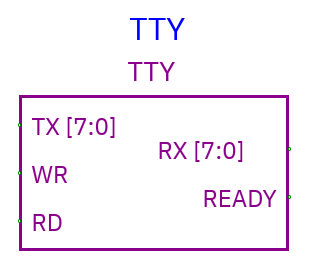
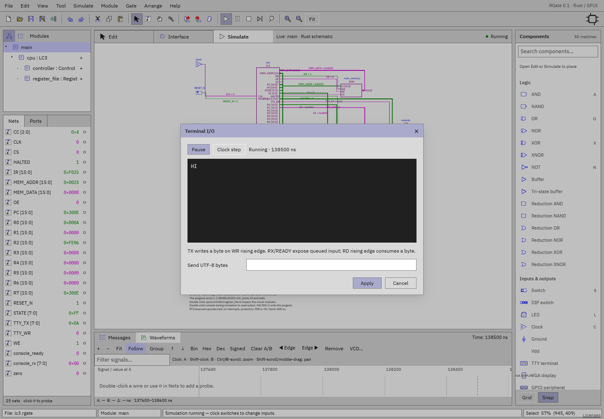

# TTY terminal

[Component index](README.md) · [LC-3 example](../examples/lc3.md)

TTY provides host text output and queued keyboard/text input through **parallel
byte buses**. Width is fixed at eight bits. Two protocols are available in
Properties; choose one before wiring because the pins change.

## Default byte-strobe protocol

| Pin   | Direction      | Meaning                                      |
| ----- | -------------- | -------------------------------------------- |
| TX    | Input, 8 bits  | Byte the circuit wants to print              |
| WR    | Input, scalar  | **Rising edge** captures one TX byte         |
| RX    | Output, 8 bits | First queued input byte, or zero if empty    |
| READY | Output, scalar | 1 when input queue is nonempty               |
| RD    | Input, scalar  | **Rising edge** consumes the current RX byte |

### Output example: print A

1. Drive TX with `0x41` (ASCII A).
2. Keep WR=0 while data settles.
3. Raise WR to 1. One byte is captured.
4. Lower WR before the next byte. Holding it high does **not** repeatedly print.

Unknown TX data at the write edge produces `?`. Writing byte 0x0A produces a
newline. Multi-byte UTF-8 sequences can display Unicode when complete; ASCII is
easiest for simple circuits.

### Input

During simulation double-click TTY. Enter text in **Send UTF-8 bytes**, then
Apply. Include a newline in the text when you want to send one. The circuit
reads the current RX value while READY=1, pulses RD, and reads the next byte.
Non-ASCII characters are multiple UTF-8 bytes. Read RX when READY=1; READY=0
indicates an empty input queue.

## TkGate-style handshake protocol

Enable **TkGate TD/RD/RTS/CTS/DSR/DTR protocol** in TTY Properties.

| Pin | Direction         | Meaning in RGate                                                    |
| --- | ----------------- | ------------------------------------------------------------------- |
| RD  | Input, **8 bits** | Circuit-to-terminal byte (different from scalar RD in default mode) |
| DSR | Input, scalar     | Rising edge schedules capture of RD                                 |
| DTR | Output, scalar    | Acknowledges known DSR state                                        |
| TD  | Output, 8 bits    | First queued terminal-to-circuit byte                               |
| CTS | Input, scalar     | Low requests input; rising edge schedules consumption               |
| RTS | Output, scalar    | 1 while CTS is low and queued input is available                    |

Capture/consumption and output acknowledgement use scheduled **10 ns delays**.
Prepare RD before raising DSR; allow acknowledgement/data to settle. For
receive, enqueue text, lower CTS, read TD when RTS=1, then raise CTS to consume
it.

## Live terminal controls

The dialog keeps simulation live. **Run/Pause** and **Clock step** operate on
the existing simulation, including a TTY inside a live child instance. Time
displayed is simulated ns.

The terminal displays received bytes as they arrive. For a recognized root
`RESET_N` switch held low, the dialog warns the circuit is in reset and offers
**Release reset**. In the LC-3 example that must be done before instruction
execution.

Apply enqueues text and closes the dialog. Cancel closes without sending.
Stop/restart simulation resets queues and output. Save the document to keep the
terminal’s wiring and properties.

Save the circuit as `.rgate` to retain its terminal wiring and properties. TTY
is available in desktop and browser schematic simulations.
