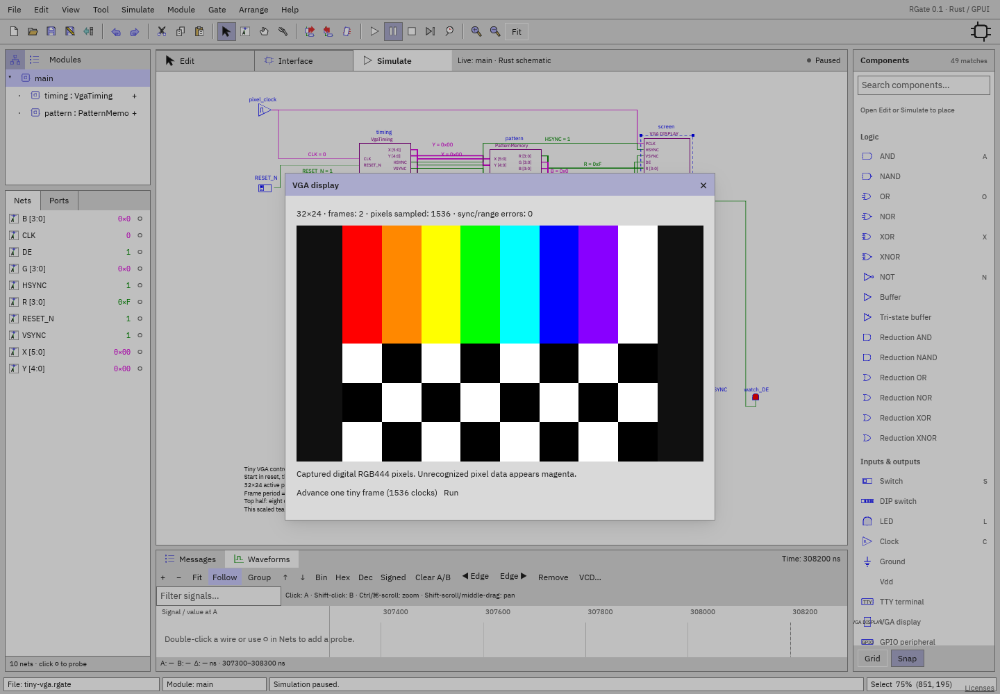

# VGA display

[Component index](README.md) · [Tiny VGA example](../examples/tiny-vga.md)

This visual peripheral observes a digital raster circuit. It doesn't generate
counters, sync, addresses, or pixels.

| Pin       | Direction             | Meaning                                                  |
| --------- | --------------------- | -------------------------------------------------------- |
| PCLK      | Input, scalar         | Capture on rising edge                                   |
| HSYNC     | Input, scalar         | Active-low line synchronization                          |
| VSYNC     | Input, scalar         | Active-low frame synchronization                         |
| DE        | Input, scalar         | Capture a pixel only when high                           |
| R / G / B | Input, four bits each | RGB444 color, expanded to eight-bit channels for display |

Native component configuration stores framebuffer width/height (default
**32×24**, validated up to 1024×768). The current UI uses that default; this is
not an arbitrary video-mode auto-detector. Pixel position advances within active
lines; falling HSYNC starts the next line after active pixels, and falling VSYNC
resets the frame position. Inconsistent sync/active-area dimensions increment an
error count. Unknown pixel data appears magenta.

During simulation double-click the component to view the captured pixels, frame
count, pixel count, and errors. Run/Pause preserves the same circuit runtime.
**Advance one tiny frame** advances 1536 root clock periods as a convenience
specifically for the bundled small mode; it is not universal timing inference.
Release reset is offered for recognized low root RESET_N.

The display has no outputs. Its framebuffer is volatile simulation state, not
saved image content. Native documents save the wiring/configuration; executable
Verilog export refuses host graphics rather than ignoring the peripheral. No
analog electrical model, standard 640×480 timing guarantee, Tcl plugin, physical
monitor, or hardware output is provided.
