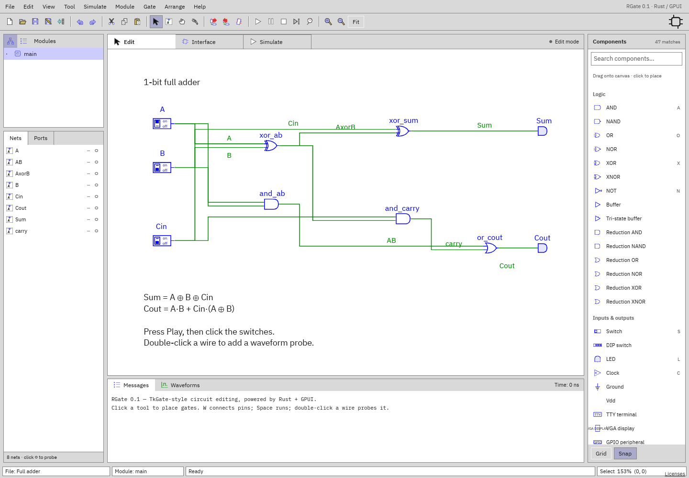

# Getting started

[Documentation home](../README.md) · [Next: Interface](interface.md)

## Desktop

From the repository root, with Rust and the platform's graphics/build
dependencies installed:

```sh
cargo run
```

On macOS, create the application bundle:

```sh
./scripts/bundle-macos.sh dev
open target/RGate.app
```

Omit `dev` for an optimized release build. The bundle helper adds a local ad-hoc
signature, not distribution notarization. macOS is the validated desktop
platform; Linux/Windows depend on GPUI's platform libraries and are not
equivalent to a tested release here.

With no filename the app opens a full adder. To open a document:

```sh
cargo run -- examples/full-adder.rgate
```

## Browser

A ready build is served from `target/web`:

```sh
python3 -m http.server 8080 --directory target/web
```

Open `http://localhost:8080`. Do not open the HTML using `file://`. The web
renderer prefers WebGPU and falls back to WebGL2. WebGPU requires a secure
context such as HTTPS or localhost. The UI is desktop-sized; mobile/touch
interaction is not optimized.

To rebuild:

```sh
rustup target add wasm32-unknown-unknown
cargo install wasm-bindgen-cli --version 0.2.129 --locked
./scripts/build-web.sh
```

Use Rust 1.98 or newer. The CLI version must match `wasm-bindgen` in Cargo.lock;
the script checks this. It searches Cargo's bin directory and, when Homebrew
Rust lacks the WASM target, can use an installed compatible rustup toolchain. It
does not silently install dependencies. Python 3.11+ is used by the build
helper. Deploy the **entire** output directory, including `pkg/snippets`, to a
static host. No simulation server is needed.

Browser **Open** is a local upload; **Save** is a download. See
[files and recovery](files-and-workspace.md).

## Try an existing circuit



1. Choose **File → Open…** and open `examples/full-adder.rgate` if another
   document is open.
2. Press **Space** or click Play to start simulation.
3. Click `A`, `B`, and `Cin` switches to change their inputs.
4. Read the Sum and Cout LEDs or values in the Nets panel.
5. Click `○` beside a net to add a waveform probe.
6. Press Space to pause. Click Stop to discard runtime values and return to
   editing.

Starting simulation does not change the saved initial input values. An edit or
Stop starts a fresh runtime next time.

## Build a small circuit

1. **File → New circuit**.
2. Search the right Components sidebar for **Switch**. Click its row, then click
   the canvas. Alternatively drag the row onto the canvas.
3. Place an **AND** gate and a second switch.
4. Place an **LED**.
5. Press **W**. Click the first switch's output and the first AND input. Repeat
   for the second switch/input. Connect the AND output to the LED input.
6. Press **V** or Escape to return to selection. Nets now lists the connections;
   placing gates alone does not create nets.
7. Press Space, toggle the switches, and inspect the LED.
8. Use **File → Save**. Desktop saves a `.rgate` file; browser downloads it.

If a pin refuses a connection, check its bit width. Use
[component properties](interface.md#properties) before wiring. If a gate or wire
is misplaced, use
[selection and wire dragging](interface.md#selection-and-moving).

## Documentation website

The documentation is published at <https://rumpl.github.io/rgate/>. GitHub
Actions builds it on pull requests and deploys it after changes land on `main`.
The site includes search, guide/component navigation, screenshots, and
light/dark appearance. This publishes documentation only, not the browser
simulator.

To preview locally:

```sh
python3 -m venv .venv-docs
.venv-docs/bin/pip install -r docs/requirements.txt
.venv-docs/bin/python -m mkdocs serve
```

The preview runs at `http://127.0.0.1:8000`; Ctrl-C stops it. To validate
without starting a server, run `.venv-docs/bin/python -m mkdocs build --strict`.
Output is in the ignored `target/docs-site/` directory. Repository-file links
are rewritten to GitHub URLs when building; Markdown links in the source docs
stay unchanged.

For the first deployment, the repository owner must select **Settings → Pages →
Build and deployment → Source: GitHub Actions**. The workflow can also be
started manually from the Actions tab. Deployment uses the `github-pages`
environment; any repository environment approval rules still apply.
