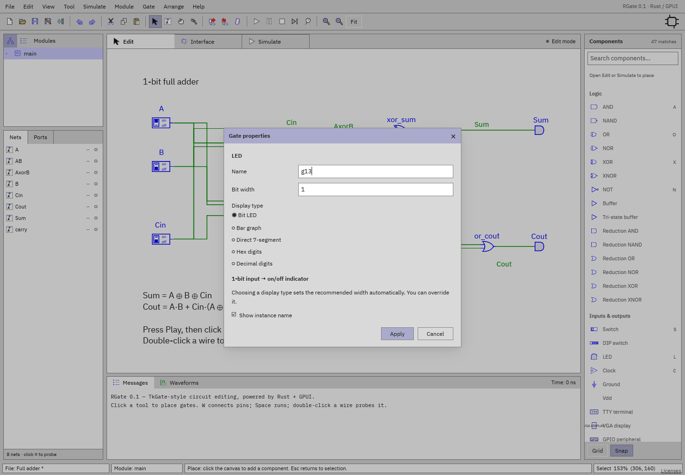

# Using the interface

[Documentation home](../README.md) ·
[Component reference](../components/README.md)

## Main regions

| Region                           | Use                                                                                                                                                              |
| -------------------------------- | ---------------------------------------------------------------------------------------------------------------------------------------------------------------- |
| Menus and tools, top             | New/open/save/export; undo/redo; selection, wiring, panning, cut/delete; rotation; simulation; zoom/Fit. Hover a toolbar tool for a status hint.                 |
| Modules, upper-left              | Tree of instance paths or List of definitions. Click a name to edit, or inspect a live instance during simulation. Triangles expand/collapse branches.           |
| Nets / Ports, lower-left         | Nets list connections in the current module, including bus widths and live values. Ports limits the list to exposed interface nets. `○`/`●` adds/removes probes. |
| Edit / Interface / Simulate tabs | Schematic or Verilog source editing, module ports, and live simulation.                                                                                          |
| Canvas, center                   | Place, wire, select, move, rotate, and inspect components.                                                                                                       |
| Components, right                | Searchable, categorized palette. Click to enter repeated-placement mode, or drag a row to place one component.                                                   |
| Messages / Waveforms, bottom     | Diagnostics and selectable/copyable messages, or the independent waveform viewer.                                                                                |
| Status, bottom edge              | File/dirty indicator, module or live path, operation hint, zoom, tool, and pointer coordinates.                                                                  |

## Resize panels

Drag the vertical dividers beside the left and right sidebars. Drag the
horizontal **Modules/Nets** separator to give the tree more height; long names
stay on one line and truncate. Drag the divider above Messages/Waveforms to
change bottom-panel height. RGate remembers these sizes for your workspace.

## Search and place components

The right search field has **Search components…** as its placeholder. Filtering
is case-insensitive and matches labels, gate names, categories, and other module
definitions. Separate words must all match. Empty groups disappear; no matches
produces an explicit message.

- Click a result, then click the canvas to place it. Escape ends repeated
  placement.
- Drag a result onto the canvas to place one snapped component.
- Type in Search to filter the palette; click the canvas to use placement
  shortcuts.
- Escape clears the search and returns focus to the canvas; Enter returns focus
  without clearing.
- Browse categories to choose a component, or use a quick-placement shortcut.

Use another definition’s `＋` to place a child module in the current parent.

## Selection and moving

Press **V** for Select mode.

- Click a gate to select it. Shift-click adds/removes gates.
- Drag a selected gate to move selected gates; connected wire endpoints follow.
- Click a wire to select that **branch**, rather than its whole net. Shift-click
  adds/removes wires.
- Drag empty canvas to box-select gate centers and wire segments intersecting
  the rectangle. Shift-drag adds to the selection.
- Drag a horizontal wire segment vertically, or a vertical segment horizontally.
  Endpoints remain attached; extra elbows are created when needed. A complete
  drag is one undo step.
- Group movement carries internal wires along with the selected gates. Drag
  individual wire segments to adjust their routes.
- Delete removes selected gates/branches. Deleting both attached gates removes
  their connecting wire; nets with no remaining gate connections are cleaned up
  on gate deletion.
- Cmd/Ctrl-A selects all. Undo/redo and cut/copy/paste use their usual
  shortcuts. Clipboard copies remap identifiers and retain internal gate-to-gate
  wires. Connect the pasted group to its new surroundings.
- R rotates clockwise; Shift-R counterclockwise. Rotation preserves electrical
  pin attachment.

Escape cancels an unfinished wire or move. Read Messages when a transaction
fails; validation rolls back invalid edits.

## Wiring and buses

Press **W**. Click a pin or an existing wire, click empty space to add
orthogonal corners, then click the destination pin/wire. Clicking a pin in
Select mode can begin wiring as well. Clicks over existing wires finish rather
than create corners.

Matching-width endpoints can share a net. Ordinary bitwise logic can accept
scalar inputs broadcast across a bus. To explicitly partition/join a bus, use
[Splitter, Concat, or Tap](../components/routing.md).

Dropping a narrower wire onto a wider existing bus automatically creates a
**read-only Tap**, initially selecting low bits from offset 0. Edit its range
before connecting more logic.

Junction dots mark connections. Add corners to guide your manual wire routes,
then use Arrange to organize the finished circuit.

## Find and arrange circuits

**Edit → Find gate/net…** (Cmd/Ctrl-F) searches across module definitions by
gate/net name, gate type, and module name. Search words are case-insensitive;
all words must match. Click a result (or Enter for the first) to navigate,
select, and center it without changing circuit contents. In a running hierarchy
with repeated definitions choose the exact instance in Tree first. This search
is distinct from component-palette search.

Select components and open **Arrange**:

- Align left/right/top/bottom or horizontal/vertical center (at least two
  gates).
- Distribute horizontally/vertically by center position (at least three),
  keeping outer centers fixed. Grid snapping may slightly alter exact spacing.
- **Auto-route selected wires** keeps component positions fixed. If no wires are
  selected, it routes wires touching selected components. Select all to route a
  whole module. It preserves net and pin references and fixed unattached
  endpoints.
- **Tidy layered layout** moves selected components; with no gate selection it
  arranges all non-comment/non-frame gates in the current module. After
  placement, select wires and route them separately.

Group dragging translates internally connected wires rigidly with their gates.
Selected dangling/internal wire segments whose attached gates move also
translate. External attached wire ends are adjusted; explicitly select junction
segments you want moved together.

Use routing to find clear paths around gates and tidy layout to improve
component spacing. Apply them to a selected section of a large design.
Organization changes support Undo; place components first, then route their
wires.

## Properties

Double-click a gate, or select it and press Enter / choose **Gate →
Properties…**. Module instances instead open their definition on a canvas
double-click; use Enter for instance properties.

Common fields include name, width, initial value, delay, and instance-name
visibility. Only relevant fields affect a component; for example clock period is
configured on a Clock. Decimal initial values and `0x` hexadecimal values are
accepted, including wide buses. Component-specific options appear below the
common fields.

Disconnect a component before changing pin widths/layout. Display-only LED modes
may change while connected. A module instance's block width/port coordinates can
be adjusted while preserving endpoints.

For a net, select its wire or Nets row and press Enter. Rename it, change its
unconnected width, or hide its label. Connected widths that conflict with pin
requirements are rejected.

During simulation, double-click RAM/ROM for runtime memory inspection, TTY for
terminal I/O, and click a DIP for hex input. Those runtime changes differ from
saved initial properties.

## Navigation and themes

Scroll/trackpad scroll pans the schematic; Cmd/Ctrl-scroll zooms around the
pointer. Native trackpad pinch zooms the view. P enters drag-to-pan; middle-drag
also pans. `+`/`−` zoom, and Cmd/Ctrl-0 or **Fit** fits the current module.

Choose **View → Theme: Classic / Modern / Dark**. Classic preserves the
TkGate-style palette. Modern and Dark offer coordinated light and dark colors.
Theme persists across sessions.

## Messages

Drag across Messages text to select it, including multiple lines. Cmd/Ctrl-C
copies the selection; Cmd/Ctrl-A selects the visible log text. The log presents
recent messages. Red errors identify failed edits, unsupported imports, or
simulation problems.

See [shortcuts](../reference/shortcuts.md) and
[troubleshooting](../reference/troubleshooting.md).
