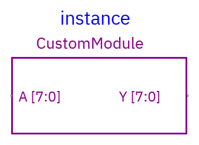
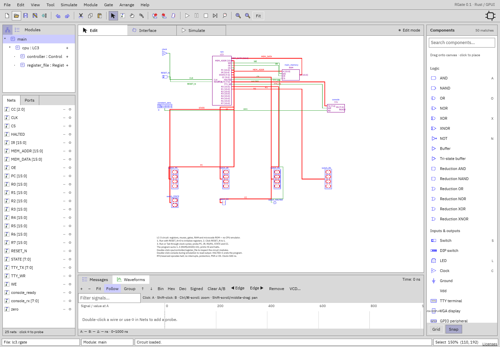

# Modules, hierarchy, and custom symbols

[Documentation home](../README.md) ·
[Live debugging](simulation.md#live-hierarchical-debugging)

A **definition** contains an editable circuit. An **instance** is a reusable
block that refers to that definition. Editing a definition changes all its
instances; runtime state is separate for each instantiated copy.

## Create a definition

Use **Module → New module…** or the `+` in the Modules header. Enter a unique
nonempty name. The new definition is selected with an empty canvas; the previous
module keeps its contents. Suggested names advance automatically (`module2`,
`module3`, …). Creation is undoable.

Build the child circuit as usual. Its unconnected gates don't create ports by
themselves.

## Expose ports

Open **Interface**. Select a net and click Input, Output, InOut, or Internal.
Inputs receive parent signals, outputs drive parents, and inout is
bidirectional. Port names become named instance pins, with the net's width.

Use Nets/Properties to choose meaningful unique net names before exposing them.
Interface changes propagate to existing instances; incompatible connected widths
are rejected, not silently rewired. Removing a port detaches affected endpoints.
Disconnect before incompatible bus changes.

## Place an instance



1. Switch to the intended parent module.
2. Click `＋` beside the desired **other** definition/instance row, then click
   the canvas; or drag its row from the right Components palette's Module
   instances group.
3. Connect its pins like ordinary components.

The current definition doesn't have its own placement `＋`. Direct or indirect
recursive hierarchies are invalid: `main → main` or `A → B → A` would create
infinite instantiation.

Double-click an instance in Edit to open the shared definition. Select/Enter
opens instance Properties instead. Return by clicking a parent/root row. Tree
shows actual instance paths; List shows each definition. Expanding one branch is
independent of another copy. Unused top-level definitions are listed separately
in Tree.

## Block layout

Instance Properties offers rectangular block width and **Port positions JSON**,
relative to the block center:

```json
{ "A": { "x": -50, "y": -10 }, "Y": { "x": 50, "y": 0 } }
```

Only existing port names are accepted; coordinates must be finite/in range. Use
x<0 for left, x>0 for right, or suitable y positions for top/bottom. This
controls drawing and wire attachment, not pin direction/width. Existing
connected wire endpoints are adjusted when applying geometry changes.

## Custom module symbol

Choose the definition, then **Module → Edit module symbol…**. The drawing is
shared by its instances.

- Choose Line, Rectangle, Ellipse, or Text.
- Drag to draw lines/shapes; click to place the entered text.
- Origin is the canvas center; coordinates snap to 5 units.
- **Undo shape** removes the last draft shape; **Clear** removes draft shapes.
- Apply validates and updates all instances as one undoable circuit edit.
  Cancel/Escape leaves the definition unchanged.

Symbols support up to 1024 validated primitives. Instance electrical ports
remain separately configurable; a drawn line is not a wire. Native saving and
Verilog layout comments retain custom geometry. No arbitrary SVG import,
Bézier/freehand tools, or symbol-library browser is provided.

## Simulation inside hierarchy



During simulation choose an **exact Tree instance**, or double-click its block.
This is live debugging: time, register/memory state, probes, and run status
remain in the same root simulation. The workspace shows
`Live: main/cpu/controller`; **↑ Parent** moves upward.

List navigation works only if the definition has a unique live instance. For
several copies choose the specific Tree path. An uninstantiated definition can't
be inspected live. Stop or choose Edit before changing circuits or running a
definition independently.

Probing a child port also probes the connected parent signal: they are aliases
of the same electrical net, not two independent traces. Internal nets and
switches resolve to their individual instance. See [simulation](simulation.md).

## Current management limits

New/edit/instantiate/symbol workflows are implemented. There is no dedicated
rename/duplicate/delete-definition dialog, parameterized module elaboration, or
library manager. Gate-instance names can be changed in Properties; that changes
its hierarchy path and can invalidate saved probes. Keep an original saved
document before reorganizing a large hierarchy.
