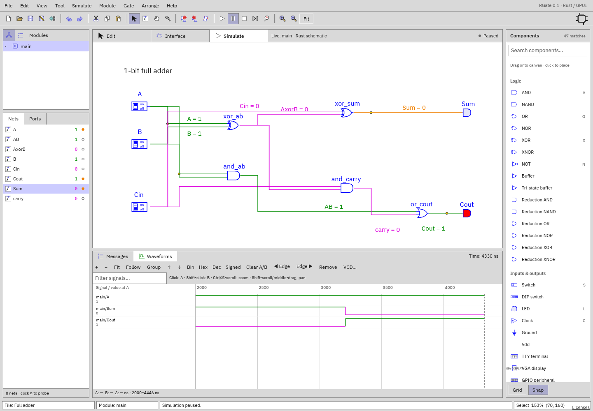

# Waveform viewer

[Documentation home](../README.md) · [Simulation](simulation.md)

Add probes, then choose **Waveforms** in the bottom panel. Resize the panel
upward if signals or controls need more room. The waveform timeline is
independent of schematic zoom/pan.

## Timeline

| Control                                   | Behavior                                                        |
| ----------------------------------------- | --------------------------------------------------------------- |
| + / −                                     | Zoom time around the viewport center                            |
| Fit                                       | Show the available retained time range                          |
| Follow                                    | Track current simulation time instead of holding a manual range |
| Cmd/Ctrl-scroll                           | Zoom around the pointer position                                |
| Shift-scroll / horizontal trackpad scroll | Pan time                                                        |
| Middle-button drag                        | Pan time                                                        |
| Ordinary vertical scroll                  | Scroll signal rows                                              |

Zoom/pan turns Follow off. Ruler tick spacing adapts to scale and width. The
footer gives the visible ns interval. Drag the divider between the name column
and timeline to resize the label area. The toolbar can scroll horizontally if
space is narrow.

## Cursors and measurements

- Click/drag in the timeline to place **A**.
- Shift-click/drag to place **B**.
- Footer shows A, B, and **Δ = absolute time difference**.
- **Clear A/B** removes both.
- Select a signal, then **◀ Edge / Edge ▶** moves A to its previous/next
  retained transition; the timeline follows that edge into view when needed.

Signal values beneath their names are evaluated **at A**, or at current
simulation time if A is unset. `—` means no known sample at that time—for
example A precedes the start of recording. Cursor placement is time-based, not
instruction-based; Δ is ns, not automatically CPU cycles.

## Signal list

Click a signal name to select it. The selected row highlights; controls act on
that signal.

- **Bin:** complete bit pattern, retaining X/Z.
- **Hex:** hexadecimal known value, or a four-state representation if not wholly
  known.
- **Dec:** unsigned decimal.
- **Signed:** two's-complement decimal.
- **↑ / ↓:** move the selected signal in the list.
- **Remove:** unprobe and remove its current history.
- **Filter signals…:** case-insensitive hierarchical-name search.
- **Group:** group by instance-path parent; click a group title to
  collapse/expand it. In grouping mode the grouping order can take precedence
  over manual global ordering.

Long names/values are clipped within the resizable label column, separately from
waveform drawing. Bus transition labels use each signal's radix; scalar signals
are high/low lines. X and Z remain visually distinct; Z is dashed/centered
rather than a known low.

## VCD export

Click **VCD…** to export all currently probed traces, not only filtered rows.
Desktop prompts for a file; browser downloads `rgate-waveforms.vcd`. Timescale
is **1 ns**, full signal names are retained, and X/Z bits are exported. Use
GTKWave, Surfer, or another VCD viewer for offline analysis.

Export includes only **retained history**: signals begin when probed and older
changes can be evicted after 4096 transitions per signal. It doesn't manufacture
samples from before recording. VCD export needs at least one probe. RGate does
not yet import VCD/FST files or export FST.

## Persistence

Workspace settings retain timeline range/follow, cursors, column width, filter,
radix, order, grouping, and collapsed groups. They do not retain event history.
After a fresh simulation saved probes reattach and begin new traces. Cursor
values may be outside new retained history until you Fit or reposition them.
